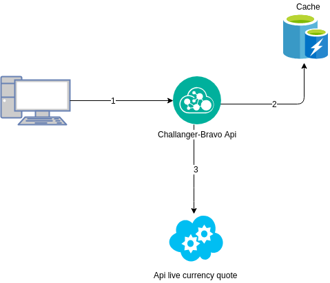
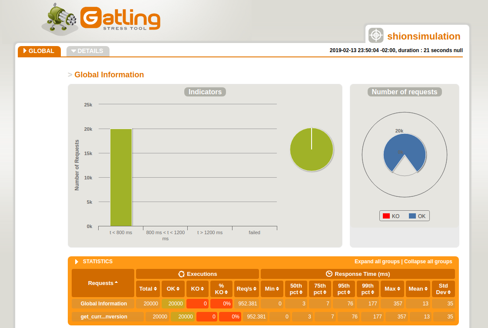
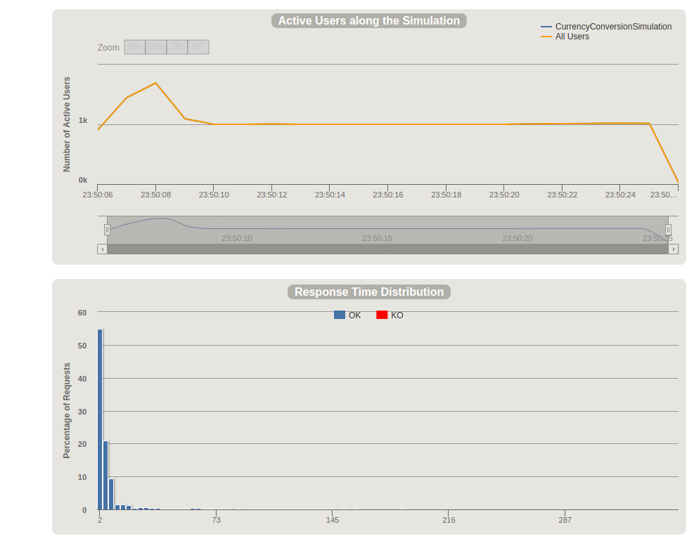
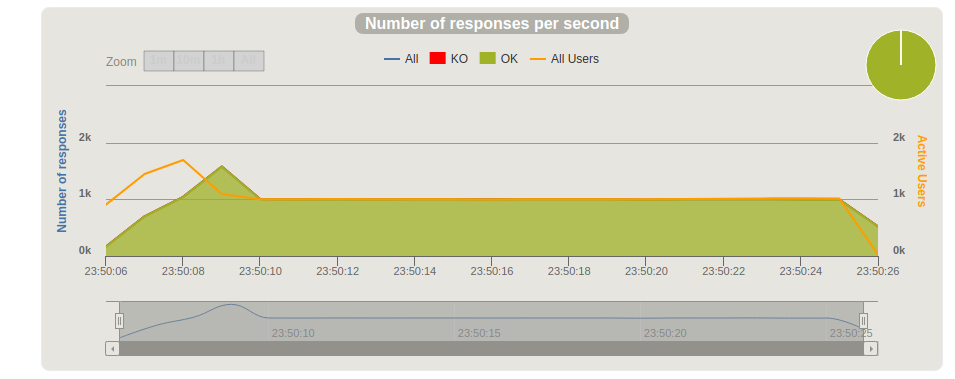
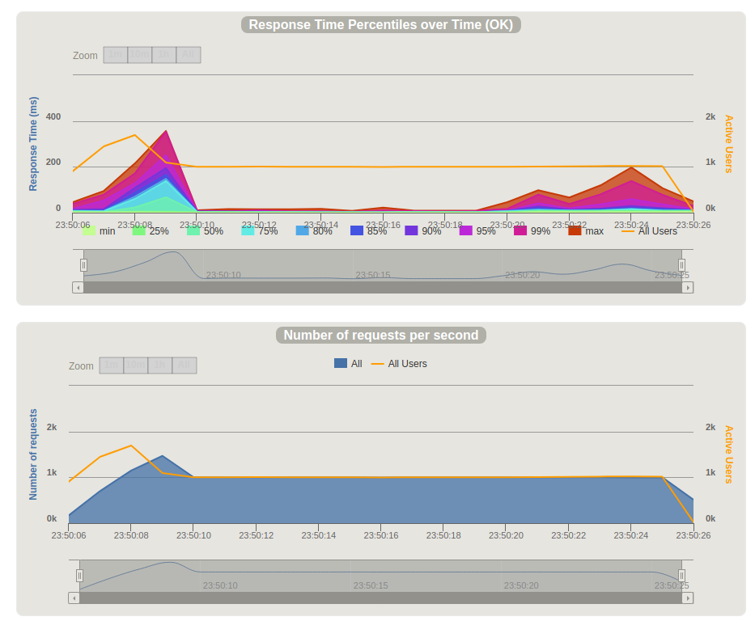

#  Desafio Bravo

Construa uma API, que responda JSON, para conversão monetária. Ela deve ter uma moeda de lastro (USD) e fazer conversões entre diferentes moedas com cotações de verdade e atuais.

A API deve converter entre as seguintes moedas:
- USD
- BRL
- EUR
- BTC
- ETH

Ex: USD para BRL, USD para BTC, ETH para BRL, etc...

A requisição deve receber como parâmetros: A moeda de origem, o valor a ser convertido e a moeda final.

Ex: `?from=BTC&to=EUR&amount=123.45`

Você pode usar qualquer linguagem de programação para o desafio. Abaixo a lista de linguagens que nós aqui do HU temos mais afinidade:
- JavaScript (NodeJS)
- Python
- Go
- Ruby
- C++
- PHP

Você pode usar qualquer _framework_. Se a sua escolha for por um _framework_ que resulte em _boilerplate code_, por favor assinale no README qual pedaço de código foi escrito por você. Quanto mais código feito por você, mais conteúdo teremos para avaliar.

## Requisitos
- Forkar esse desafio e criar o seu projeto (ou workspace) usando a sua versão desse repositório, tão logo acabe o desafio, submeta um *pull request*.
- O código precisa rodar em macOS ou Ubuntu (preferencialmente como container Docker)
- Para executar seu código, deve ser preciso apenas rodar os seguintes comandos:
  - git clone $seu-fork
  - cd $seu-fork
  - comando para instalar dependências
  - comando para executar a aplicação
- A API precisa suportar um volume de 1000 requisições por segundo em um teste de estresse.

## Critério de avaliação

- **Organização do código**: Separação de módulos, view e model, back-end e front-end
- **Clareza**: O README explica de forma resumida qual é o problema e como pode rodar a aplicação?
- **Assertividade**: A aplicação está fazendo o que é esperado? Se tem algo faltando, o README explica o porquê?
- **Legibilidade do código** (incluindo comentários)
- **Segurança**: Existe alguma vulnerabilidade clara?
- **Cobertura de testes** (Não esperamos cobertura completa)
- **Histórico de commits** (estrutura e qualidade)
- **UX**: A interface é de fácil uso e auto-explicativa? A API é intuitiva?
- **Escolhas técnicas**: A escolha das bibliotecas, banco de dados, arquitetura, etc, é a melhor escolha para a aplicação?

## Dúvidas

Quaisquer dúvidas que você venha a ter, consulte as [_issues_](https://github.com/HotelUrbano/challenge-bravo/issues) para ver se alguém já não a fez e caso você não ache sua resposta, abra você mesmo uma nova issue!

Boa sorte e boa viagem! ;)

  

# Resposta ao Desafio Bravo
Foi construída 1 API, respondesndo em JSON. A api foi feita em **java** com spring boot, openFeign no netflixOss para integraço com a api externa de cotação, spring chache e caffeine para gerenciamento do cache.
Como pode ser visto abaixo, para a arquitetura escolhida, é usado um worker que é capaz de buscar cotações atuais com lastro em USD entre diversas moedas e à partir de fontes sendo realizado um cache que é atualizado a cada 5s, podendo ser extendido. 

## Fontes de cotação on-line
  - https://apilayer.com/

## Arquitetura

  

### Worker:
- é realizado um cache da api que retorn as cotações.
- Resposável por manter as cotações sempre atualizadas.
- Permite diminuir o tempo de resposta da API já que não necessitará consultar a atualização na internet.

### API:
- A api foi contruída em Java 9 já contenplando os recursos da programação funcional,Lombok para deixa o java menos verboso, spring boot 2, spring cacheble, caffeine para gerenciamento de cache,openFeign netflix oss, mockito e Junit para testes, maven como gerenciador de dependencias e Docker
- Responde aos requests http de converções dos usuários e processa as requisições entregando o resultado da cotação processada no formato **JSON**.

## EXECUTANDO

### Created jar file 
**mvn clean install**

### Create image 
**docker build -f DockerFile -t challenge-bravo .**

### Run image 
**docker run -p 8080:8080 --name challenge-bravo  challenge-bravo**

## TESTES de carga
- Para os testes de performance utilizei a integração do framework gatling escrevendo em scala, aqui meu projeto que utilizei nos testes https://github.com/fabriciofelipe/gatling-load-performance 
- Atendeu mais de 1000mil requisições por segundo

- Global Information --------------------------------------------------------
- > request count                                      20000 (OK=20000  KO=0     )
- > min response time                                      0 (OK=0      KO=-     )
- > max response time                                    357 (OK=357    KO=-     )
- > mean response time                                    13 (OK=13     KO=-     )
- > std deviation                                         35 (OK=35     KO=-     )
- > response time 50th percentile                          3 (OK=3      KO=-     )
- > response time 75th percentile                          7 (OK=7      KO=-     )
- > response time 95th percentile                         76 (OK=76     KO=-     )
- > response time 99th percentile                        177 (OK=177    KO=-     )
- > mean requests/sec                                952.381 (OK=952.381 KO=-     )
- ---- Response Time Distribution ------------------------------------------------
- > t < 800 ms                                         20000 (100%)
- > 800 ms < t < 1200 ms                                   0 (  0%)
- > t > 1200 ms                                            0 (  0%)
- > failed                                                 0 (  0%)
- ================================================================================

  

  

  

  

### backLog
- Criar uma estrutura de fallback(podemos usar a arquitetura da netflixOSS), para buscar cotação em outras fontes.

